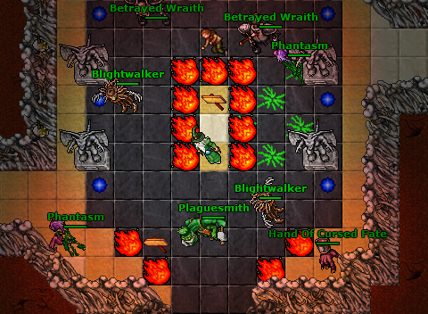
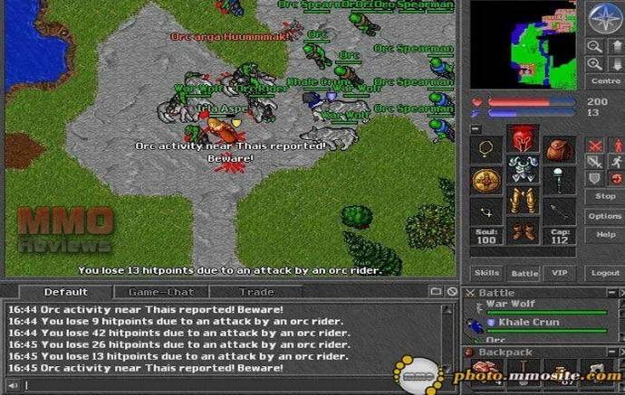
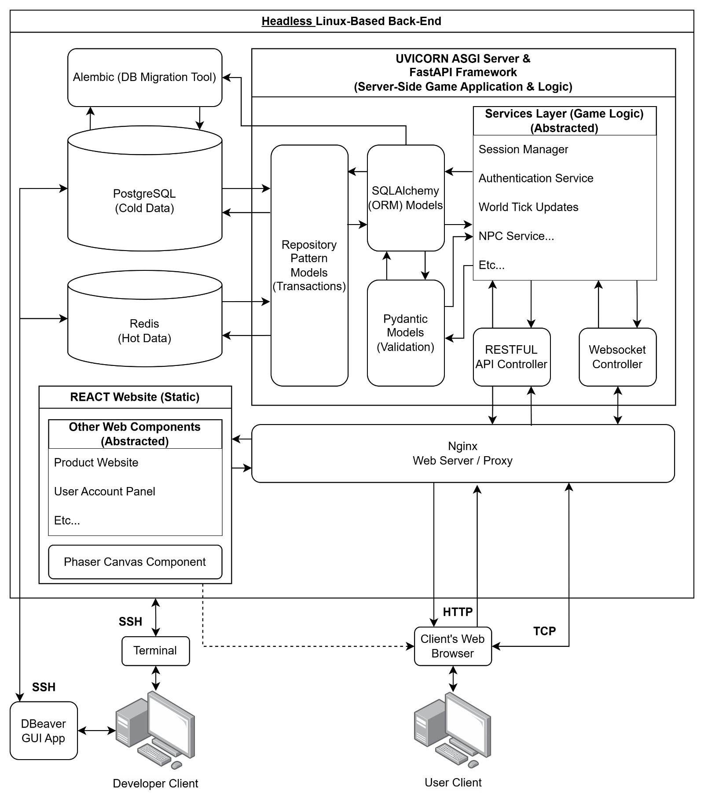
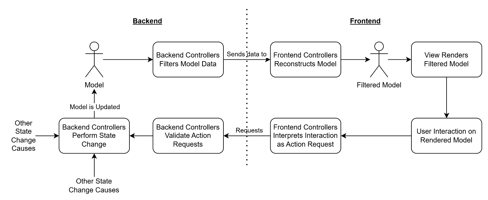
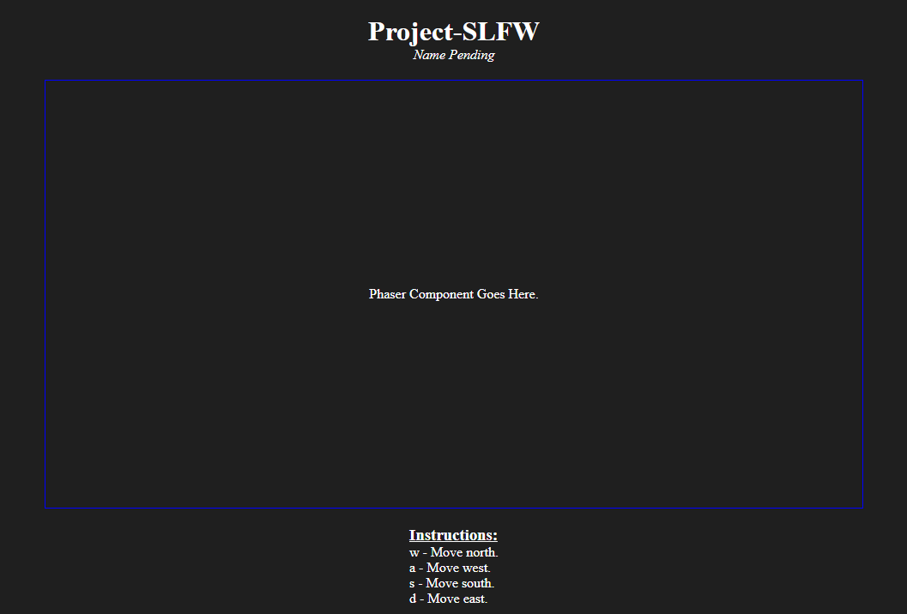

- [Table of Contents](#table-of-contents)
- [Conceptualisation](#conceptualisation)
  - [Introduction](#introduction)
  - [Proposed Core Features](#proposed-core-features)
  - 
  - [Inspirations](#inspirations)
    - [Ecology System – Ultima Online](#ecology-system-ultima-online)
    - [Economy System – X Game Series](#economy-system-x-game-series)
    - [Skill Usage Advancement System – Old School RuneScape](#skill-usage-advancement-system-old-school-runescape)
    - [No Character Class System – Old School RuneScape](#no-character-class-system-old-school-runescape)
    - [2D Cardinal Grid Based Movement & Interaction – Tibia](#d-cardinal-grid-based-movement-interaction-tibia)
    - [Minimal Window Based UI – Tibia](#minimal-window-based-ui-tibia)
    - [Self-Motivated Autonomous NPCs – S.T.A.L.K.E.R. Game Series](#self-motivated-autonomous-npcs-s.t.a.l.k.e.r.-game-series)
    - [Self-Motivated Autonomous NPCs – The Sims Game Series](#self-motivated-autonomous-npcs-the-sims-game-series)
    - [Life-Sim RPG Gameplay – Kenshi](#life-sim-rpg-gameplay-kenshi)
- [Version 0.1](#version-0.1)
  - [(WSN_V0.1) Vague Draft of World Setting & Narrative](#wsn_v0.1-vague-draft-of-world-setting-narrative)
    - [Current Game World’s State](#current-game-worlds-state)
  - 
  - [(DI_V0.1) Proof of Concept Back-End Infrastructure](#di_v0.1-proof-of-concept-back-end-infrastructure)
    - [Tech Stack Description](#tech-stack-description)
    - [Proposed Project Folder Structure](#proposed-project-folder-structure)
    - [Hybrid MVC Software Architectural Pattern](#hybrid-mvc-software-architectural-pattern)
  - [(CSUIF_V0.1) Proof of Concept Client-Side Application](#csuif_v0.1-proof-of-concept-client-side-application)
    - [Mock-Ups](#mock-ups)
    - [Systems Design](#systems-design)
  - [(SSF_V0.1) Proof of Concept Server-Side Application](#ssf_v0.1-proof-of-concept-server-side-application)
- [References](#references)

\[Placeholder for Cover Image\]

This is a <u>living document</u> for the development of an indie game project that comprises of a Simulated Living Fantasy World (SLFW).

**  **

# Table of Contents

[Conceptualisation [3](#conceptualisation)](#conceptualisation)

[Introduction [3](#introduction)](#introduction)

[Proposed Core Features [3](#proposed-core-features)](#proposed-core-features)

[Inspirations [3](#inspirations)](#inspirations)

[Ecology System – Ultima Online [3](#ecology-system-ultima-online)](#ecology-system-ultima-online)

[Economy System – X Game Series [3](#economy-system-x-game-series)](#economy-system-x-game-series)

[Skill Usage Advancement System – Old School RuneScape [4](#skill-usage-advancement-system-old-school-runescape)](#skill-usage-advancement-system-old-school-runescape)

[No Character Class System – Old School RuneScape [4](#no-character-class-system-old-school-runescape)](#no-character-class-system-old-school-runescape)

[2D Cardinal Grid Based Movement & Interaction – Tibia [4](#d-cardinal-grid-based-movement-interaction-tibia)](#d-cardinal-grid-based-movement-interaction-tibia)

[Minimal Window Based UI – Tibia [5](#minimal-window-based-ui-tibia)](#minimal-window-based-ui-tibia)

[Self-Motivated Autonomous NPCs – S.T.A.L.K.E.R. Game Series [5](#self-motivated-autonomous-npcs-s.t.a.l.k.e.r.-game-series)](#self-motivated-autonomous-npcs-s.t.a.l.k.e.r.-game-series)

[Self-Motivated Autonomous NPCs – The Sims Game Series [5](#self-motivated-autonomous-npcs-the-sims-game-series)](#self-motivated-autonomous-npcs-the-sims-game-series)

[Life-Sim RPG Gameplay – Kenshi [6](#life-sim-rpg-gameplay-kenshi)](#life-sim-rpg-gameplay-kenshi)

[Version 0.1 [7](#version-0.1)](#version-0.1)

[(WSN_V0.1) Vague Draft of World Setting & Narrative [7](#wsn_v0.1-vague-draft-of-world-setting-narrative)](#wsn_v0.1-vague-draft-of-world-setting-narrative)

[Current Game World’s State [7](#current-game-worlds-state)](#current-game-worlds-state)

[(DI_V0.1) Proof of Concept Back-End Infrastructure [8](#di_v0.1-proof-of-concept-back-end-infrastructure)](#di_v0.1-proof-of-concept-back-end-infrastructure)

[Tech Stack Description [9](#tech-stack-description)](#tech-stack-description)

[Proposed Project Folder Structure [10](#proposed-project-folder-structure)](#proposed-project-folder-structure)

[Hybrid MVC Software Architectural Pattern [10](#hybrid-mvc-software-architectural-pattern)](#hybrid-mvc-software-architectural-pattern)

[(CSUIF_V0.1) Proof of Concept Client-Side Application [11](#csuif_v0.1-proof-of-concept-client-side-application)](#csuif_v0.1-proof-of-concept-client-side-application)

[Mock-Ups [11](#mock-ups)](#mock-ups)

[Systems Design [12](#systems-design)](#systems-design)

[(SSF_V0.1) Proof of Concept Server-Side Application [13](#ssf_v0.1-proof-of-concept-server-side-application)](#ssf_v0.1-proof-of-concept-server-side-application)

[References [14](#_Toc201773172)](#_Toc201773172)

# Conceptualisation

## Introduction

<u>As per project management document end-product description</u>:

<u>At its largest scale</u>, the Simulated Living Fantasy World (SLFW) game will simulate, a living fantasy world, where all NPC entities and players can mutually affect and interact one another. There would be a persistent sandbox and framework for NPCs to have their own motivations and objectives, and the game world itself simulates ecology and an economy. Economies and other systems will follow the principles of supply and demand, where there will be “no free lunch”. Consequently, player actions will have a direct effect on the state of the world and can shape it based on the established systems of that world. State changes in the game world will occur and be reflected to the player in real-time.

## Proposed Core Features

<u>As per project management document product goals, the following is a list of features at the highest level of abstraction for the intended end-product</u>:

- 

- Fantasy Setting

- Online Multiplayer

- Persistent State World

- Sandbox Based World and Entities

- Simulated Economy and Ecology

- Self-Motivated Autonomous NPCs

- Life-Sim RPG Gameplay

- Skill Usage Advancement System

- Minimalistic UI

- Immersive and dynamic narratives and dialogues supported with Artificial Intelligence (AI).

## 

## Inspirations

### Ecology System – Ultima Online

The original ecology system in Ultima Online was a groundbreaking simulation where animals, monsters, and plants interacted dynamically without player input. Herbivores would graze on vegetation, predators would hunt them, and monster populations would compete or migrate, creating a self-sustaining food chain. If predators overhunted an area, they'd eventually starve or move on, and if herbivores weren’t controlled, they'd overgraze and affect the environment. Resources like fish and ore also had hidden spawn regions, affected by overuse.

Video Resource: <https://youtu.be/KFNxJVTJleE?si=gfl8QC3xw69tTalP>

### Economy System – X Game Series

The economy system in X is a fully dynamic, player-influenced simulation where every good, ship, and station component is part of a complex, interdependent supply chain. Resources are harvested, refined, and processed by AI factions and the player alike, with factories requiring raw materials to produce higher-tier goods, which in turn fuel construction, shipbuilding, and technology. Prices fluctuate based on local supply and demand, and shortages or trade route disruptions can ripple through the entire economy. Players can engage at any level—manually trading, automating fleets, or building vast station empires—impacting the market directly. This system ensures that no economy is static; everything is built, consumed, and transported in real time by ships and stations that exist physically in the game world.

Video Resource: <https://youtu.be/edf0TfwDjjo?si=WYzK7bOVbwMov6gq>

### Skill Usage Advancement System – Old School RuneScape

In RuneScape, the skill advancement system is experience-based, where players gain XP in a skill by performing related actions—such as mining ores to level Mining, casting spells to level Magic, or cooking food to level Cooking. Each skill has a level progression curve, requiring exponentially more XP to reach higher levels.

Video Resource: <https://youtu.be/sbXyo8lZrfw?si=5OjQEMB-t0XsHSFD>

### No Character Class System – Old School RuneScape

RuneScape’s classless system offers players complete freedom to develop their characters without being locked into fixed roles like warrior, mage, or archer. Instead, every skill—from combat to crafting to gathering—can be levelled independently, allowing players to mix and match abilities to suit their playstyle. This flexibility supports a wide range of gameplay paths, from pure combat builds to peaceful “skiller” accounts, and makes it easy to pivot to new content without starting over. It also fosters long-term engagement, as progression is continuous and cumulative rather than siloed into predefined classes. The result is a more personal, sandbox-style character journey where specialization is a choice, not a restriction.

Video Resource: <https://youtu.be/sbXyo8lZrfw?si=5OjQEMB-t0XsHSFD> (same as previous link)

### 2D Cardinal Grid Based Movement & Interaction – Tibia

Tibia’s movement and user interface (UI) are intentionally minimalistic, emphasizing simplicity and efficiency over graphical polish. Movement is grid-based and tile-by-tile, with players navigating the world using either mouse clicks or keyboard arrow/WASD keys. Characters move in cardinal directions across a 2D top-down map, and diagonal movement is limited, creating a distinct, chessboard-like feel. There’s no animation blending or pathfinding; each step is discrete, and collision with objects or creatures must be manually navigated. This rigidity, while old-school, contributes to the game’s tactical combat and movement mechanics, especially in dangerous areas where tile control and positioning are critical for survival.

<figure>

<figcaption>
: (CipSoft, n.d.)
</figcaption>
</figure>

Video Resource: <https://youtu.be/q-dsihP3lYw?si=YJxQwZVY9PMxGvg2>

### Minimal Window Based UI – Tibia

Players interact through small modular windows that can be docked or rearranged—such as the inventory, character stats, spellbook, and chat. Combat is controlled using hotkeys and a basic right-click context menu, with spell casting relying on typed commands or assigned hotkeys rather than visual targeting systems.

<figure>

<figcaption>
: (MMO Reviews, n.d.)
</figcaption>
</figure>

### Self-Motivated Autonomous NPCs – S.T.A.L.K.E.R. Game Series

The A-Life system in S.T.A.L.K.E.R. is a groundbreaking AI simulation that governs the behaviour of all non-player characters (NPCs), creatures, and factions in the Zone as they live out autonomous routines independent of the player. These entities patrol, eat, sleep, fight, flee, and interact with each other dynamically, often resulting in spontaneous events like mutant attacks, faction skirmishes, or NPCs looting corpses and completing tasks. The world feels alive because actions occur whether the player is present or not, creating a persistent ecosystem where the balance of power and survival constantly shifts. This unpredictability enhances immersion, as the Zone becomes an evolving character itself, with emergent gameplay driven by AI decisions rather than scripted encounters.

Video Resource: <https://youtu.be/Et54Cr8gzj4?si=nkgLIrYWYQ5PBynE>

### Self-Motivated Autonomous NPCs – The Sims Game Series

In The Sims series, NPCs (including the player-controlled Sims when left idle) exhibit self-motivated and autonomous behaviour driven by needs, personality traits, and environmental stimuli. Each Sim has a set of dynamic needs—such as hunger, hygiene, fun, and social interaction—that they seek to fulfill without direct player input, choosing actions like eating, sleeping, or chatting based on priority. Additionally, traits like "Neat," "Lazy," or "Romantic" influence how they react to situations and interact with others, while moodlets provide temporary emotional states that further shape behaviour. This autonomy allows Sims to pursue relationships, careers, hobbies, or even chaos independently, making the game world feel reactive and alive as emergent stories unfold from their interactions and decisions.

### Life-Sim RPG Gameplay – Kenshi

Kenshi offers a unique CRPG experience rooted in open-ended sandbox gameplay, where survival, exploration, and emergent storytelling take precedence over structured quests or traditional narrative arcs. Players begin as a nearly powerless character in a harsh, post-apocalyptic world and must carve their own path—whether through trade, thievery, diplomacy, or brutal combat. There are no classes or levels; instead, stats and skills improve through use, much like in classic simulation RPGs. Combat is real-time and squad-based, with each limb individually damageable, leading to injuries that impact movement, effectiveness, or even survival. Death is permanent unless mitigated through prosthetics, healing, or strategic retreats, making every encounter a meaningful risk.

The game also features deep base-building and squad management systems, allowing players to recruit followers, form factions, and construct settlements that serve as trading hubs, farms, or military outposts. AI-driven characters and factions roam the world with their own goals, engaging in battles, expanding territories, or reacting to the player’s rise in power. The economy is dynamic, with trade caravans and resource flows affected by conflict and geography. Kenshi's CRPG depth lies not in dialogue trees or linear plots, but in its complex systems interacting organically to produce unscripted, often brutal stories of survival and ambition. It's a world that doesn't care whether you succeed or fail—but it always remembers what you tried to do.

Video Resource: <https://youtu.be/aeHDFGHTB1Y?si=mHSzAIY5J70UC9_w>

# Version 0.1

<u>The following are a list of encoded development Epics that will define the first iteration of the project</u>:

- (WSN_V0.1) Vague Draft of World Setting & Narrative

- (BEI_V0.1) Proof of Concept Back-End Infrastructure

- (CSA_V0.1) Proof of Concept Client-Side Application

- (SSA_V0.1) Proof of Concept Server-Side Application

The Epics above are detailed in the subsequent subsections of this document.

## (WSN_V0.1) Vague Draft of World Setting & Narrative

In a sprawling continent where ancient ruins whisper of long-forgotten empires and the scars of arcane cataclysms shape both landscape and lore, the Simulated Living Fantasy World (SLFW) offers a grounded, yet magical setting steeped in classic medieval fantasy. Kingdoms rise and fall across temperate valleys, harsh tundras, and enchanted forests, each governed by their own economies, belief systems, and politics. Magic exists as a natural force—dangerous and wondrous—used sparingly by the wise and exploited by the power-hungry. Townsfolk, nobles, and wandering tribes each play their role in a living world where every creature, from lowly rats to draconic titans, responds to hunger, fear, and opportunity.

At the centre of this dynamic world stands the Adventurer’s Guild, a neutral and venerable institution found in every major settlement. Acting as the hub for quests, contracts, and world events, the Guild is where would-be heroes, seasoned mercenaries, and curious wanderers converge. Whether seeking coin, glory, or purpose, adventurers interact with a complex web of factions, feuding merchant houses, secretive cults, and warring realms. NPCs are not static quest markers, but autonomous agents with needs, grudges, ambitions, and personal stories. They live, work, migrate, trade, and even die—independent of player influence, yet fully responsive to it.

This world is not just alive—it remembers. Overharvested forests dwindle, banditry rises if trade routes are ignored, and empires collapse under the weight of economic imbalance. The ecology is delicate and reactive, and the economy is built on physical production, labour, and scarcity. Whether you're rebuilding a burned village, hunting beasts threatening the food chain, or disrupting black market caravans for ideological gain, your choices echo. SLFW's narrative isn't delivered in linear arcs, but in the quiet shifts of power, prosperity, and ruin—all unfolding through systemic emergence rather than scripted fate.

### Current Game World’s State

<u>The following will be designed for in this version’s project iteration</u>:

- 

- Biomes:

  - Towns

  - Fields

- Character Entities:

  - Humans

    - Townsfolk

  - Wildlife

    - Deer

- Townships:

  - ‘Town A’

- Buildings:

  - House

## 

## (DI_V0.1) Proof of Concept Back-End Infrastructure

The initial Tech-Stack will be designed to be monolithic as the project is intended to be small and resources of all categories (labour, budget, etc…) are limited. During coding however, encapsulation practices will be utilised to allow for future scaling and changes to the deployment architecture.

<u>The figure below showcases the basic monolithic tech-stack architecture</u>:

<figure>

<figcaption>
: Monolithic Tech-Stack Architecture of the Project.
</figcaption>
</figure>

### Tech Stack Description

**<u>React + Phaser</u>**:

React builds the user interface (UI) of the game, while Phaser handles the 2D game engine logic and rendering inside a browser canvas. React manages UI state, events, and layout, while Phaser drives the actual game world visuals and input logic. They run entirely in the client’s browser (the static website that provides the game interface is served via Nginx from the backend to the client before the client runs the “game” on their browser).

**<u>Nginx</u>**:

Nginx is a high-performance web server that serves static frontend files (like React+Phaser builds) and acts as a reverse proxy for API and WebSocket requests to the backend. It handles HTTPS termination, load balancing, and routes traffic cleanly to Uvicorn.

**<u>Uvicorn</u>**:

Uvicorn is an ASGI server that runs the FastAPI backend. It supports both HTTP and WebSocket protocols, managing connections and concurrency for real-time gameplay and standard API routes. It listens behind Nginx and executes the Python application code.

**<u>FastAPI + Pydantic + SQLAlchemy</u>**:

FastAPI is the core backend framework that defines HTTP and WebSocket routes. It uses Pydantic (library) for validating and serializing request/response data, and SQLAlchemy (library) to model and interact with PostgreSQL via ORM (object-relational mapping). Together, they power all the game logic, from saving characters to real-time player movement handling.

**<u>Redis</u>**:

Redis is an in-memory key-value store used for fast, temporary data like player positions, entity states, or game ticks. It's ideal for real-time game systems due to low latency, and it can offload or persist important state to PostgreSQL over time.

**<u>PostgreSQL</u>**:

PostgreSQL is the primary, persistent relational database. It stores structured game data long-term — players, inventory, world regions, skill stats, etc... SQLAlchemy ORM maps the Python models to this schema, making it easy to work with.

**<u>Alembic</u>**:

Alembic is a schema migration tool that tracks and applies changes to the PostgreSQL database structure over time. It generates versioned scripts based on SQLAlchemy model changes so we can evolve our schema without losing existing data.

### Proposed Project Folder Structure

<u>Draft of the project’s folder structure</u>:

**<u>Project-SLFW</u>**/

├── backend/

│ ├── app/

│ │ ├── api/ \# Route controllers (HTTP + WebSocket)

│ │ ├── core/ \# Configs, settings, app startup logic

│ │ ├── db/ \# Database session, Alembic setup

│ │ ├── models/ \# SQLAlchemy ORM models

│ │ ├── schemas/ \# Pydantic models (request/response)

│ │ ├── services/ \# Game logic, session manager, economy, etc.

│ │ ├── repositories/ \# DB access logic (CRUD, joins, queries)

│ │ └── main.py \# FastAPI app entrypoint

│ ├── alembic/ \# Alembic migrations

│ │ ├── versions/ \# Auto-generated migration files

│ │ └── env.py \# Migration context logic

│ ├── alembic.ini \# Alembic config

│ ├── requirements.txt \# Python deps

│ └── seed.py \# Optional: insert default DB data

├── frontend/

│ ├── public/ \# Static files and Phaser assets

│ ├── src/

│ │ ├── components/ \# React UI components

│ │ ├── phaser/ \# Game scenes, physics, game logic

│ │ ├── hooks/ \# Custom React hooks for state/service integration

│ │ ├── services/ \# Game, player, map, asset, API, websocket services

│ │ ├── assets/ \# Game assets (images, audio, maps)

│ │ └── App.jsx \# App root

│ ├── index.html

│ ├── vite.config.ts

│ └── package.json

├── nginx/

│ └── nginx.conf \# Nginx config (serves React + proxies API)

├── README.md

├── Dockerfile \# For starting up containers quickly during development.

└── run.sh \# Launch script (alembic + uvicorn + frontend)

### Hybrid MVC Software Architectural Pattern

The tech-stack described above allows for the project to implement a hybrid of the MVC software architecture pattern and real-time client-server sync: backend Models are mutated via controller logic (FastAPI), and changes are streamed to the frontend where lightweight client-side models are reconstructed and rendered. This allows authoritative world logic on the server while providing responsive client-side views.

In this hybrid architecture, it is imperative that all model state changes occur only at the backend which maintains the “one source of truth”, such that users are not able to maliciously compromise the integrity of the models’ state. Data sent to the frontend should only be what is required for the user’s client to render what the users are allowed to perceive, and only what information the users are allowed to know. Information sent back from the frontend should only be action requests that are validated when received by the backend.

For example, an enemy is rendered by the frontend application using positional data from the backend, and only information regarding the enemy’s health is provided to the player – all other information is filtered out by the backend. The player can then choose to attack the enemy, which sends an action request to the backend, and is then validated. If perhaps the enemy is too far from the player, the validation fails, and the player is informed via a return message. If the enemy is indeed in range, the attack succeeds, and a state change occurs in the backend and the original model is updated. Subsequently, the updated model’s state is filtered again (to what is allowed for the frontend) and the updated data sent back to the frontend allows the re-rendering of the enemy with less health.

<figure>

<figcaption>
: Hybrid MVC abstraction.
</figcaption>
</figure>

## (CSUIF_V0.1) Proof of Concept Client-Side Application

<u>For this first iteration of the project, the React based web interface will provide users with the following abstract features</u>:

- Simple single page website to access the game.

- A Phaser canvas component that renders a portion of the game world via a viewport.

- Simple shape and label-based representations of game world entities and tiles.

- The ability to control and move the viewport (centred by a camera entity).

- The ability to click on entities visible through the viewport to display their attributes in pop-up.

### Mock-Ups

#### Product Website – HTML Mockup

For this iteration of the product, all that is really needed for the product website is DOM and single page to hold the Phaser GUI component. There is some space provided for a product title and text-based instructions (updated to the current iteration’s available features). There is also no need for any user profile specific affordances (like logging in) as all users in this iteration will spawn an invisible camera entity to assist with moving the viewport around.

<figure>

<figcaption>
: The initial website of the project will just be a Home page that hosts the Phaser component that renders the GUI of the game.
</figcaption>
</figure>

#### Game GUI – Sketch

The Game GUI’s is just a component that sits, embedded, in the base website and renders the game world.

### Systems Design

#### Design Considerations

The following standard design considerations are taken into account when designing and developing the project’s frontend’s application:

- **Separation of Concerns**: Keep UI, game logic, and data/services separate.

- **Reusability**: Services and hooks can be reused across scenes and components.

- **Scalability**: Structure supports adding new features (scenes, services, UI) without major refactoring.

- **Responsiveness**: Phaser canvas resizes with its parent container. The React website itself to have layout considerations across 3 main aspect ratios: 21:9, 16:9 and 9:16, with an approximately 20% responsive buffer between each.

- **Clean Lifecycle Management**: Properly create/destroy, or mount/unmount game instances, react components, and event listeners.

**Note**: Refer to the “Proposed Project Folder Structure” section above as you read the next few document subsections.

#### Component & Scene Structure

- React Components handle UI (menus, overlays, inventory panels).

- Phaser Scenes handle game logic and rendering (e.g., Overworld, Battle, Menu).

#### Services Layer (src/services/)

<u>Purpose</u>: Encapsulate logic not tied to UI or rendering. Promotes modularity and reusability.

<u>Examples</u>:

- playerService.js — Player stats, inventory, progression.

- gameStateService.js — Save/load/reset game state.

- mapService.js — Map loading and parsing.

- assetService.js — Asset preloading and management.

- apiService.js — HTTP requests to backend (leaderboards, saves).

- websocketService.js — Real-time multiplayer or chat via WebSockets.

#### Hooks Layer (src/hooks/)

<u>Purpose</u>: Bridge React state/UI with service logic (e.g., usePlayer, useGameState).

#### Abstract Architecture – Frontend

**Note**: The following descriptions and illustrations are not the definitive schemas for the frontend but are a draft of an ever evolving/changing design.

#### Class Diagrams

## (SSF_V0.1) Proof of Concept Server-Side Application

<u>For this first iteration of the project</u>

# References

CipSoft. (n.d.). *Screenshots*. Retrieved from tiba.com: https://www.tibia.com/abouttibia/?subtopic=screenshots

MMO Reviews. (n.d.). *Tibia*. Retrieved from MMO Reviews: https://www.mmoreviews.com/tibi/
