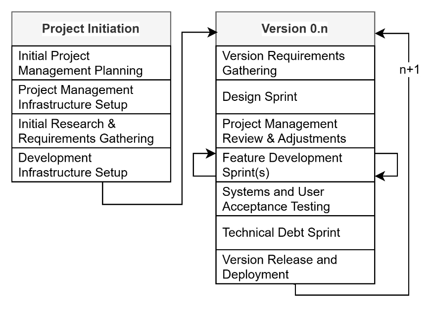
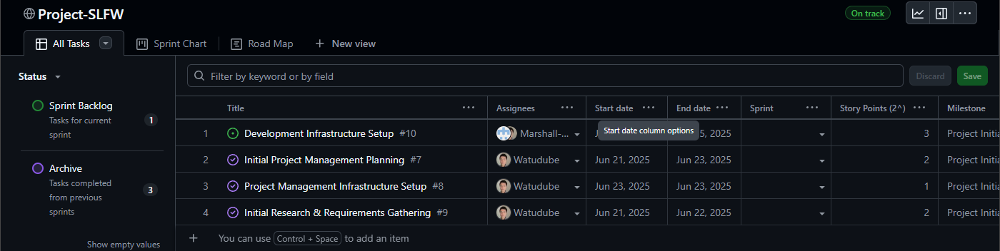
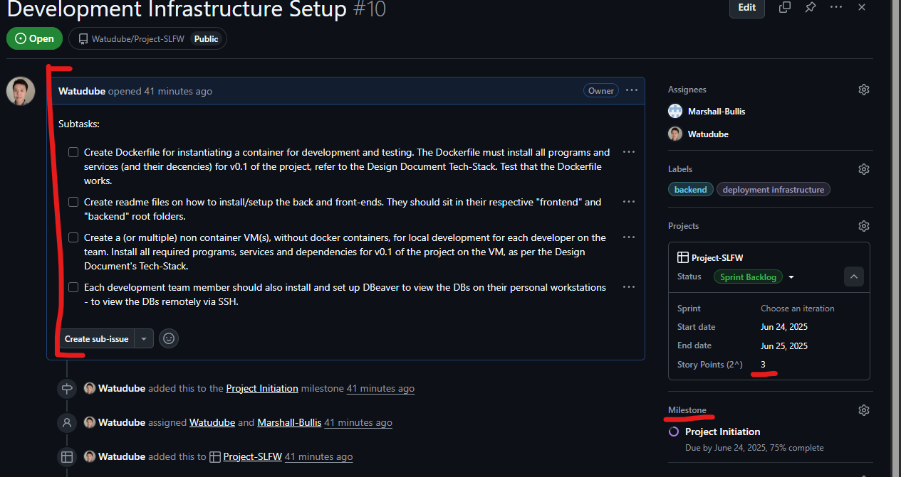
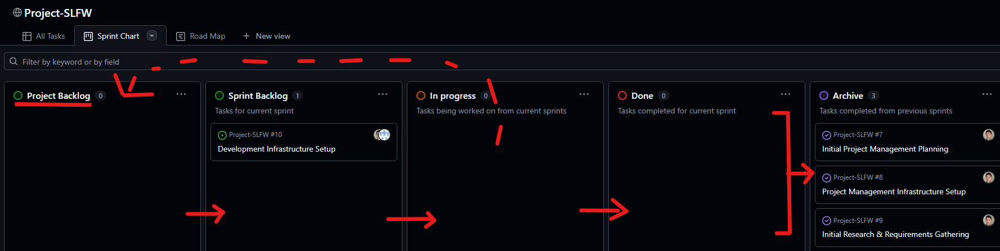

- [Table of Contents](#table-of-contents)
- [Project Initiation](#project-initiation)
  - [End-Product Description](#end-product-description)
  - [Core Goals](#core-goals)
    - [Project/Stakeholder Goals](#projectstakeholder-goals)
    - [Product Goals (As Per Design Document Core Features)](#product-goals-as-per-design-document-core-features)
  - 
  - [Development Methodology](#development-methodology)
  - [Project Management Infrastructure](#project-management-infrastructure)
    - [Code Repository](#code-repository)
    - [Project Planning](#project-planning)
    - [Files & Cloud Storage](#files-cloud-storage)
    - [Communication Plan](#communication-plan)
- [Version 0.1](#version-0.1)
  - [Roles & Responsibilities](#roles-responsibilities)
  - [Work Break Down Schedule](#work-break-down-schedule)

\[Placeholder for Cover Image\]

This is a <u>living document</u> for the management of the indie game project: Simulated Living Fantasy World (SLFW).

# Table of Contents

[Table of Contents [2](#_Toc201600845)](#_Toc201600845)

[Project Initiation [3](#project-initiation)](#project-initiation)

[End-Product Description [3](#end-product-description)](#end-product-description)

[Core Goals [3](#core-goals)](#core-goals)

[Project/Stakeholder Goals [3](#projectstakeholder-goals)](#projectstakeholder-goals)

[Product Goals (As Per Design Document Core Features) [3](#product-goals-as-per-design-document-core-features)](#product-goals-as-per-design-document-core-features)

[Development Methodology [3](#development-methodology)](#development-methodology)

[Project Management Infrastructure [4](#project-management-infrastructure)](#project-management-infrastructure)

[Code Repository [4](#code-repository)](#code-repository)

[Project Planning [4](#project-planning)](#project-planning)

[Files & Cloud Storage [6](#files-cloud-storage)](#files-cloud-storage)

[Communication Plan [6](#communication-plan)](#communication-plan)

[Version 0.1 [7](#version-0.1)](#version-0.1)

[Roles & Responsibilities [7](#roles-responsibilities)](#roles-responsibilities)

[Work Break Down Schedule [7](#work-break-down-schedule)](#work-break-down-schedule)

# Project Initiation

## End-Product Description

<u>As per design document introduction</u>:

<u>At its largest scale</u>, the Simulated Living Fantasy World (SLFW) game will simulate, a living fantasy world, where all NPC entities and players can mutually affect and interact one another. There would be a persistent sandbox and framework for NPCs to have their own motivations and objectives, and the game world itself simulates ecology and an economy. Economies and other systems will follow the principles of supply and demand, where there will be “no free lunch”. Consequently, player actions will have a direct effect on the state of the world and can shape it based on the established systems of that world. State changes in the game world will occur and be reflected to the player in real-time.

## Core Goals

### Project/Stakeholder Goals

1.  To complete a project that makes all team members appear more employable.

2.  To learn about and implement unfamiliar technologies in a project context.

3.  To practice and incorporate learnt skills and software development concepts into a modestly sized and cohesive project.

### Product Goals (As Per Design Document Core Features)

<u>As per design document core features</u>:

- Fantasy Setting

- Online Multiplayer

- Persistent State World

- Sandbox Based World and Entities

- Simulated Economy and Ecology

- Self-Motivated Autonomous NPCs

- Life-Sim RPG Gameplay

- Skill Usage Advancement System

- Minimalistic UI

- Immersive and dynamic narratives and dialogues supported with Artificial Intelligence (AI).

## 

## Development Methodology

After an initial Project Initiation phase, the development team will utilise a relaxed version of the Agile-Scrum method for the development of Project SLFW. The method will allow for iterative design and development, with progressively changing goals and requirements, but with flexible sprint durations and velocity targets. As this is an indie project, with no monetary stake or incentive, and with all stakeholders being the developers themselves, there is no need for accurate velocity work estimates and target dates. User stories may be used in the future for sprint planning, however at the initial project initiation, project requirements will be defined by the stakeholders.

Sprints will be largely defined by new or incrementally improved features, design work, or technical debt clearing. Requirements for any Version’s release cycle will be defined during the Version’s design sprint (see the figure below).

<u>The figure below illustrates the development loop the team will undertake</u>:

<figure>

<figcaption>
: Development methodology for Project SLFW.
</figcaption>
</figure>

## Project Management Infrastructure

### Code Repository

The code repository will be hosted on Github, under the following URL:

<https://github.com/Watudube/Project-SLFW>

**<u>Note</u>**: The repository itself is intended to be made public as this project is experimental, for learning, and intended as a showcase of skill and ability of the developers of this project. Collaborators will be invited manually.

<u>The following should be the general structure of the code repository</u>:

> **<u>Project-SLFW</u>**/
>
> ├── frontend/.. \# React/Phaser UI, etc…
>
> ├── backend/.. \# Django/FastAPI, etc…
>
> ├── infrastructure/.. \# Nginx, Docker, k8s, etc…
>
> ├── misc/.. \# Misc files and folders.
>
> ├── README.md

**<u>Note</u>**: The above structure is not definitive and is just a generalised representation of the repo, refer to the Design Document for detailed project root structures per each project version.

### Project Planning

Project planning and progress tracking will be done using GitHub projects, the project itself is tied to the GitHub repo, doing so is required to create new backlog items. Visualisation and management of the of the project will be done primarily from 3 views: the All Tasks, Sprint Chart and Road Map.

All Tasks is where new items, in the form of tasks, issues or “User Stories” can be created by contributors. As a standard operating practice, collaborators creating new backlog items will be required to add a title, description, relevant labels and initial story point estimate.

Story point estimates will use the “powers of 2” method, where story points can be 1, 2, 4, 8,16, 32 , etc…, with the points representing the size of the task (i.e. a task with story points of 4, takes twice as long as a task with story points of 2). The development team will start with the estimate that 1 story point will take half a day to complete. Agile based planning poker activities will not be conducted at project initiation as the team at the time only consists of 2 developers.

<figure>

<figcaption>
: Project-SLFW’s All Tasks view on GitHub.
</figcaption>
</figure>

As per the figure below, an item’s “Sprint” is not added on creation. It is only updated and filled when assigned to a Sprint. Milestone in GitHub projects will be treated as User Story Epics that can stretch across sprints and version iterations. Contributors creating new tasks should allocate them to a Milestone if an appropriate one is available – if one is not available, a new one should be created after discussion with the Project Manager.

<figure>

<figcaption>
: Creating a new GitHub Project backlog task/issue.
</figcaption>
</figure>

The image below shows how the Sprint Chart should be used. New All Tasks items are automatically given “Project Backlog” status. After a Sprint is planned, the chosen Project Backlog items are moved to the “Sprint Backlog”, then their “Sprint” field is updated to reflect what sprint the task is assigned to. Items being worked on are moved to “In Progress”, if they are not finished before the end of a sprint, their completion status is updated and then placed back in the Project backlog with their “Sprint” field being updated to none. During a sprint, when an item is completed, they are placed in “Done”. When the sprint is over, all “Done” items are placed in “Archive”.

<figure>

<figcaption>
: Backlog item movement.
</figcaption>
</figure>

### Files & Cloud Storage

Larger files, documentation and assets will be stored by a shared OneDrive folder by one of the stakeholders, the email of which is omitted for privacy reasons. Contributors will be invited manually.

<u>The following should be the general structure of the cloud storage</u>:

> **‘Project SLFW’**/
>
> ├── Assets/.. \# Large files and media assets.
>
> ├── Documentation/.. \# Documentation of the project (e.g. Design Document)
>
> ├── ‘Frontend Designs’/.. \# Frontend designs and prototype related files.
>
> ├── Misc/.. \# Miscellaneous files.
>
> ├── ‘Project Management Diagrams’/.. \# Project management related diagrams.
>
> ├── ‘System Design Diagrams’/.. \# Systems design related diagrams.
>
> ├── …

### Communication Plan

- A Discord server will be used as the main text-based communication and coordination hub for the project. Discord server membership is via invite from stakeholders only.

- Zoom will be used for online meetings. Zoom meeting room invite links will be distribute at the time of each actual meeting.

# Version 0.1

## Roles & Responsibilities

| **<u>Role</u>** | **<u>Project Member</u>** | **<u>Description</u>** |
|:--:|:--:|----|
| **Product Owners** | Hai Peng Kevin Goh, Marshall Bullis | Stakeholder representatives for the project. I.e. the ultimate benefactors of the project. |
| **Project Manager** | Hai Peng Kevin Goh | Does project planning activities and business analysis, where applicable. |
| **Development Team Leader** | Hai Peng Kevin Goh | Coordinates designers and developers for the project. |
| **Deployment Architecture Lead** | Marshall Bullis | In charge of designing AND implementing the deployment architecture of the development, testing and release builds of the product. |
| **Systems Design Lead** | Hai Peng Kevin Goh | In charge of designing and modelling complex systems of the core product. This includes UML diagrams such as Class, Sequence and State diagrams. |
| **UI Design Lead** | Hai Peng Kevin Goh | In charge of designing and prototyping client-side user interfaces. |
| **Backend Development Lead** | Marshall Bullis | In charge of server-side implementation of the product, |
| **Frontend Development Lead** | Hai Peng Kevin Goh | In charge of client-side implementation of the product. |
| **Digital Art Lead** | \- | In charge of the project’s digital art creation and direction. This includes digital assets such as sprites, 2D/3D models, artwork, etc… |
| **Sound Design Lead** | \- | In charge of the project’s audio asset’s creation, direction and composition. |

: Project SLFW's Development Team's roles and responsibilities.

## Work Break Down Schedule

Todo after Version 0.1’s design sprint.
